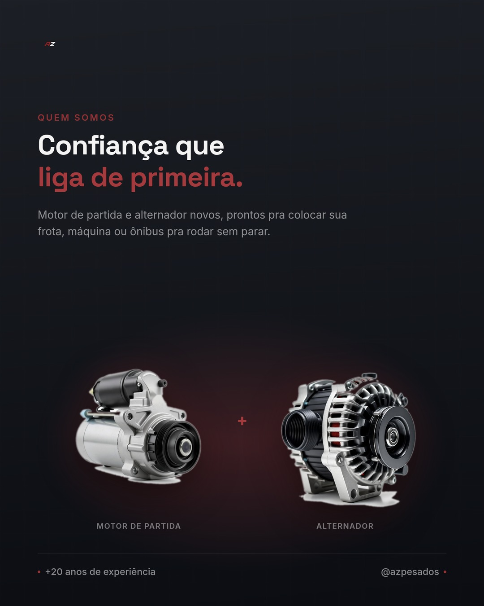

# Post Fixado 1 — Quem Somos

**Objetivo:** Apresentar a AZ Pesados para quem chega no perfil pela primeira vez.
**Formato sugerido:** Carrossel (capa + 3-4 slides) ou imagem única com peça em destaque.

## Imagem

Composição própria: título de impacto ("Confiança que liga de primeira.") e as duas peças que a AZ vende — motor de partida + alternador — lado a lado. Usa a paleta e tipografia do site (grafite `#1B1B1B`, vermelho vinho `#933235`, Space Grotesk/Inter) para o post "encaixar" no feed junto do site, sem repetir o layout do hero nem o texto do site.

## Legenda

🔧 Bem-vindo à AZ Pesados!

Somos especialistas em **motores de partida e alternadores novos** para veículos pesados: caminhões, máquinas, tratores, empilhadeiras, ônibus e muito mais.

Sabemos que quando um veículo pesado para, o prejuízo não espera. Por isso, nosso trabalho é simples: entregar peças novas, de qualidade, para você voltar a rodar o mais rápido possível.

📍 Aqui você encontra peça nova (não recondicionada), com procedência e o suporte técnico que sua frota ou máquina precisa.

Segue a gente e fica por dentro de dicas, novidades e bastidores do nosso trabalho! 🚛⚡

## Hashtags sugeridas

#AZPesados #MotorDePartida #Alternador #VeiculosPesados #CaminhaoPesado #PecasParaCaminhao #FrotaPesada #MaquinasPesadas #Empilhadeira #Tratores #OnibusPesado #PecasNovas #ManutencaoPesada #TransportadeCargas #Diesel #MecanicaPesada

## Briefing visual

- Logo da AZ Pesados em destaque
- Foto de um motor de partida ou alternador novo, bem iluminado, fundo neutro
- Se possível, foto real de caminhão/máquina no pátio da empresa
- Tom visual: técnico, confiável, cores fortes (ex: laranja/preto/cinza remetendo a oficina/indústria)

## Status

- [ ] Legenda revisada
- [x] Arte/imagem produzida
- [ ] Publicado e fixado no perfil
