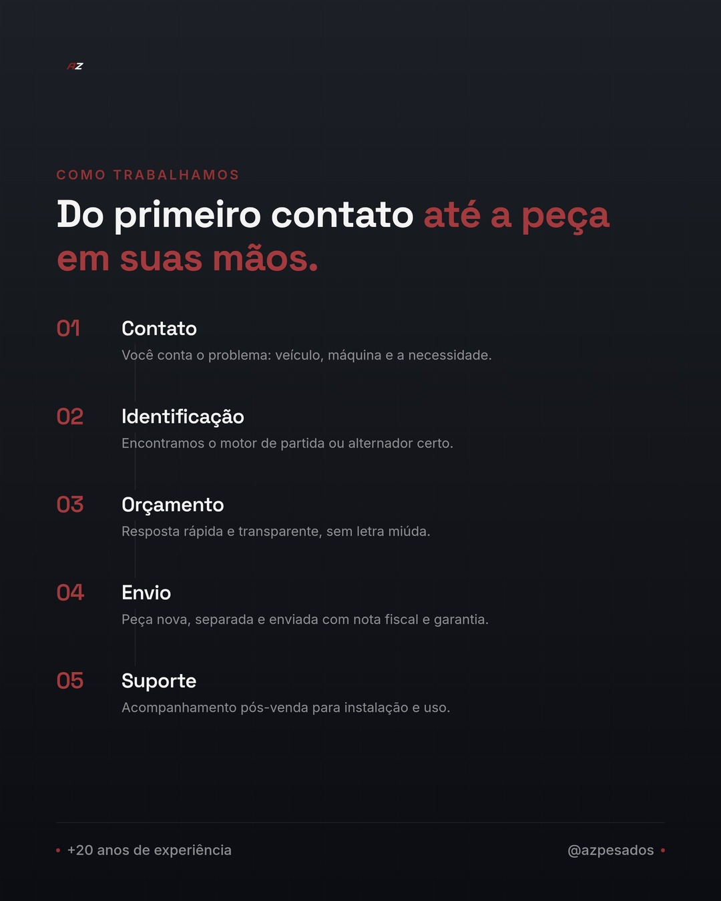

# Post Fixado 3 — Como Trabalhamos

**Objetivo:** Explicar o processo de compra/atendimento, gerando confiança em quem ainda não comprou.
**Formato sugerido:** Carrossel (passo a passo) ou reels mostrando o processo.

## Imagem

Versão single-image com os 5 passos em timeline vertical, fundo grafite igual ao post "Quem Somos" para fechar o trio com identidade coesa.

## Legenda

⚙️ Como funciona comprar com a AZ Pesados?

1️⃣ **Você nos conta o problema** — qual veículo, qual máquina, qual é a necessidade. Pode chamar no direct ou WhatsApp.

2️⃣ **A gente identifica a peça certa** — motor de partida ou alternador compatível com seu caminhão, trator, empilhadeira, ônibus ou máquina pesada.

3️⃣ **Orçamento rápido e transparente** — sem enrolação, sem letra miúda.

4️⃣ **Peça nova, separada e enviada** — com nota fiscal e garantia.

5️⃣ **Suporte pós-venda** — ficamos disponíveis para tirar dúvidas de instalação e funcionamento.

Simples assim: menos tempo parado, mais tempo rodando. 🚛🔩

📲 Chama a gente no direct ou WhatsApp e vamos resolver.

## Hashtags sugeridas

#AZPesados #MotorDePartida #Alternador #ComoFunciona #AtendimentoAZPesados #VeiculosPesados #CaminhaoPesado #FrotaPesada #MaquinasPesadas #Empilhadeira #Tratores #OnibusPesado #PecasNovas #SuportePosVenda #ManutencaoPesada

## Briefing visual

- Carrossel em formato de passo a passo numerado (1 a 5)
- Ícones ou fotos ilustrando cada etapa (mensagem, peça, caixa/entrega, garantia)
- Último slide com CTA claro: WhatsApp/contato
- Manter identidade visual dos outros dois posts fixados (mesma paleta e fontes)

## Status

- [ ] Legenda revisada
- [x] Arte/imagem produzida
- [ ] Publicado e fixado no perfil
